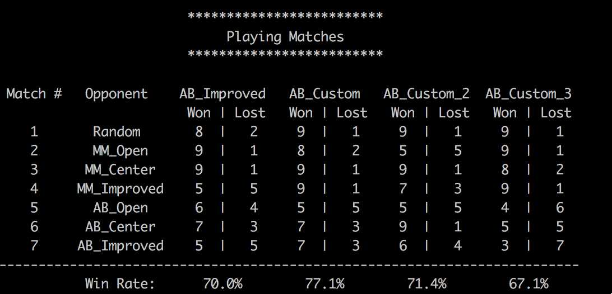

My code:

```python
def custom_score(game, player):
    if game.is_loser(player): return float("-inf")
    if game.is_winner(player): return float("inf")
    return float(len(game.get_legal_moves(player)))
def custom_score_2(game, player):
    if game.is_loser(player): return float("-inf")
    if game.is_winner(player): return float("inf")
    own_moves = len(game.get_legal_moves(player))
    opp_moves = len(game.get_legal_moves(game.get_opponent(player)))
    return float(own_moves - opp_moves)
def custom_score_3(game, player):
    if game.is_loser(player): return float("-inf")
    if game.is_winner(player): return float("inf")
    own_moves = len(game.get_legal_moves(player))
    opp_moves = len(game.get_legal_moves(game.get_opponent(player)))
    return float(own_moves - 2*opp_moves)
```

custom_score is the same with  `open_move_score`;

custom_score2 is the same with `improved_score`;

custom_score3 is slightly modified of  `improved_score`. It is metioned in the course video, which "chases the opponent".

My result is:



How to read table? e.g. the first slot: AB_Improve wins 8 and lost 2 over Random

Because the first 2 move is random, the result may have some fluctuation. In fact, another 2 run give these results: 71.4%        58.6%        65.7%        68.6%.

​                                                            61.4%         71.4%        67.1%         65.7%                                       

Each run cost 15 minutes.

From observation, we can see AlphaBetaPlayer > MinimaxPlayer > RandomPlayer. This is expected, because RandomPlayer has no optimization, and AlphaBetaPlayer has iterative deepening that can think "deeper" than depth-limited MinimaxPlayer.

`center_score` is not effective because the center part of the board will be fully packed at the end of the game, where can be more dangerous than edge area.

`open_score` has the best average winning rate.  `improve_score` is slightly worse but still good enough. 